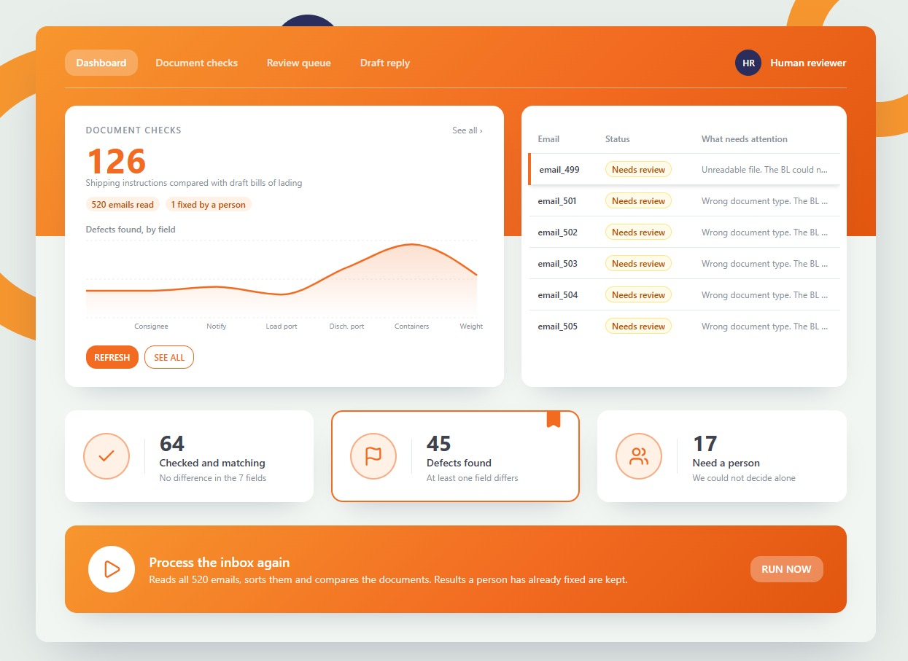

# human.exe-prototype: shipping document verification

> Find the document requests. Compare the shipment details. Explain any mismatch.

**[Live demo](https://human-exe-prototype.vercel.app)** | **[Slides](<https://docs.google.com/presentation/d/1nBu9_34_vJa1sHAVcDkhVTnMAcMzjMFUQvC6v7dG0Gs/edit?slide=id.g40a0cbd1ca3_44_0#slide=id.g40a0cbd1ca3_44_0>)** | [Documentation](docs/)

## The problem

A shipping team's inbox mixes many kinds of messages. Staff must find the requests to check documents, then compare a Shipping Instruction (SI)
with a draft Bill of Lading (BL) by eye: shipper, consignee, notify party, port of loading, port of discharge, container count and gross weight.
One missed difference means corrections and delays. Our data has 520 emails.

## What it does

| Step | What the system does |
|---|---|
| **Classify** | Sorts every email into BL_COMPARISON, SI_REQUEST, INVOICE_QUERY, GENERAL or SPAM, using rules on the email body (subjects are often misleading). |
| **Extract** | Reads the SI and the BL from .txt, .xlsx, .docx, text PDFs and scanned PDFs (OCR). Corrupt files are detected, never a crash. |
| **Compare** | Matches the 7 fields by meaning ("Port of Loading" = "Load Port") and reports OK, MISMATCH (with the exact fields and both values) or NEEDS_REVIEW. |
| **Ask for help** | When it cannot decide (wrong document, missing attachment, unreadable file, blank value), it opens a review with the evidence. A person answers, the comparison runs again, and every step is recorded. |

## Results

Measured with the organizers' self-check scoreboard (run dated 20/9/2026):

| Measure | Value |
|---|---|
| Final score | 0.9539 |
| Defects found with the exact fields (end to end) | 46 of 46 |
| Defect F1 | 1.00 |
| Classification F1 | 0.8463 |

We also checked 78 answers by hand against the source documents: There are 15 emails 'OK', 18 emails need human review and 45 emails mismatch. 

Within 46 mismatch emails, there are a few field causing mismatch such as shipper, port of loading, port of discharge etc.

Within 18 emails that need human review, there are 3 emails consist unreadable attachment, 5 emails have missing value, 5 emails have missing attachment, and 5 emails have wrong document type. 

The results are all confirmed.

## How it works

    inbox --> classify --> read documents --> compare 7 fields --> report
                                  |                  |
                                  +--> needs a person --> review queue --> answer --> compare again

Everything is deterministic rules. AI is used in two optional places and never decides a comparison (see below).

## AI in this project

1. **Scan reader.** OCR is the default. A vision model (Gemini) is a fallback for scans OCR cannot read. On our 6 scanned pages OCR read 21 of 21 fields
   correctly and the model 14 of 21, so OCR stays the default. Details: [docs/AI_SCAN_READER.md](docs/AI_SCAN_READER.md).
2. **AI-drafted replies.** For every case that needs a person, the app drafts an email to the sender. The facts come from our checks; the AI may only
   reword; every AI answer is checked (a dropped fact, a new number or a link means the safe template is used); a person sends it. In our test, 12 of 12
   AI drafts passed the check. Details: [docs/AI_DRAFTED_REPLIES.md](docs/AI_DRAFTED_REPLIES.md).
3. **AI in development.** How we used an AI assistant to build and test this project, and what humans verified: [docs/AI_USE.md](docs/AI_USE.md).

## Cloud

The app runs as one container (Python, Tesseract and the data) on Vercel. The API key lives in Vercel's environment settings, not in the code.
The container is stateless: results are rebuilt when it starts, and a review answer given on the live site is lost when the container sleeps.
A database for reviews is the next step.

## Run it yourself

### On Windows (PowerShell)

1. Install **Python 3.12** (python.org; tick "Add python.exe to PATH") and **Tesseract** (search "Tesseract Windows installer").
   Add the Tesseract folder (usually `C:\Program Files\Tesseract-OCR`) to your Windows `Path`, then open a **new** PowerShell window.
   Without Tesseract everything works except reading the 3 scanned emails, and the tests skip the two that need it.
2. Then:

       git clone <repository address>
       cd <repository folder>
       python -m venv .venv
       .venv\Scripts\Activate.ps1
       pip install -r requirements.txt
       python scripts/check_data.py            # must print OK
       python -m unittest discover -s tests    # about a minute, ends with OK
       $env:AUTO_RUN="1"; uvicorn app.api:app --port 8000

   Open http://localhost:8000. To see progress while the tests run, add `-v`.
   
With Docker:

    docker compose up --build
    open http://localhost:8000

Without Docker (Python 3.12 and Tesseract needed):

    python3 -m venv .venv && source .venv/bin/activate
    pip install -r requirements.txt
    AUTO_RUN=1 uvicorn app.api:app --port 8000

Pages: `/` (dashboard), `/report`, `/reviews-ui`, `/docs` (the API). Optional settings go in a `.env` file: `GEMINI_API_KEY`, `GEMINI_MODEL`.
Tests: `python3 -m unittest discover -s tests`. Do all the parts fit together: `python3 scripts/check_contracts.py`.

## Repository map

| Path | What is in it |
|---|---|
| `app/classify.py` | the email classifier |
| `app/readers/` | readers for txt, xlsx, docx, PDF and scans |
| `app/mapping.py`, `normalize.py`, `decide.py` | field matching, cleaning and the decision |
| `app/pipeline.py`, `db.py`, `api.py` | the pipeline, storage and web API |
| `app/suggest.py` | drafted replies |
| `src/` | the React dashboard |
| `tests/`, `scripts/` | tests and helper scripts |
| `docs/` | notes, scores and screenshots |

## How we checked our work

Our team's workflow combines AI efficiency with human oversight. We begin by running AI-driven automated tests, followed by a manual review to verify the results. Once we confirm the accuracy of the outputs, we leverage AI to build the core system. Finally, we iteratively refine our code by continuously cross-referencing our verified answers with the automated checks.

* AI Testing & Manual Review: We execute automated AI tests and hand-verify the outputs to ensure total accuracy.

* AI-Assisted Development: Once the baseline data is confirmed, we utilize AI to construct the system architecture.

* Continuous Optimization: We iteratively improve the codebase by evaluating our manual benchmarks and automated test results simultaneously.

## Limits

**Accuracy and coverage**

- **Classification is rule-based and tuned to this dataset.** On the organizers' self-check scoreboard, classification F1 is 0.85 (final score 0.95).
  The mistakes come from two groups: 91 emails that only ask us to send a draft BL (no attachments) are labelled GENERAL, while the scoreboard counts
  them as BL_COMPARISON, and 7 reminder emails are labelled SI_REQUEST but counted as GENERAL. Email wording we have not seen may also end up as GENERAL.
- **Scanned documents.** Our OCR reads the three scanned pairs and compares them. The scoreboard suggests the organizers expect such cases to be
  escalated as unreadable: we caught 2 of 5 unreadable cases (escalation recall 0.85). We chose to compare what can be read instead of always escalating.
- **Only 7 fields are compared** (shipper, consignee, notify party, port of loading, port of discharge, container count, gross weight). Other details of
  a bill of lading, such as the goods description, marks or freight terms, are not checked. Weights are understood in kilograms and metric tonnes only.
- **One dataset, English.** We built and tested on 520 emails and 250 attachments. The text is English, with a few Chinese labels recognised. Other
  languages and other document layouts are untested.
- **The hand check is a sample.** We checked 78 answers against the source documents (the mismatches, the review cases and 15 of the OK results).
  All were confirmed, but that is not every OK result.

**AI**

- **The vision model is only a fallback.** On our six scanned pages it read 14 of 21 checked fields correctly against 21 of 21 for OCR, and OCR was
  enough for every page. When the model does run, the page image is sent to Google's service.
- **AI-drafted replies are English only** and were tested on 12 emails (12 accepted by our fact check). A person must still read and send every draft.
  If the AI service is unavailable, the app shows the plain template instead.

**Deployment**

- **The live demo is stateless.** Results are rebuilt when the container starts. A review answer given on the live site is lost when the container
  sleeps (after about 5 idle minutes), and the first visit after a pause is slow. Running it with Docker locally keeps answers in a database file.
- **No login.** Anyone with the link can press RUN NOW or answer a review. That is fine for a demo, not for production.

## Team

Breann: Classifier and scoring, frontend.

Shyen: Readers for txt, xlsx, docx. Hand check.

Yinnie: PDF and scan readers, AI scan test.

Sean: Comparison, hand check, and deployment.

Jack: backend, integration, frontend and deployment.